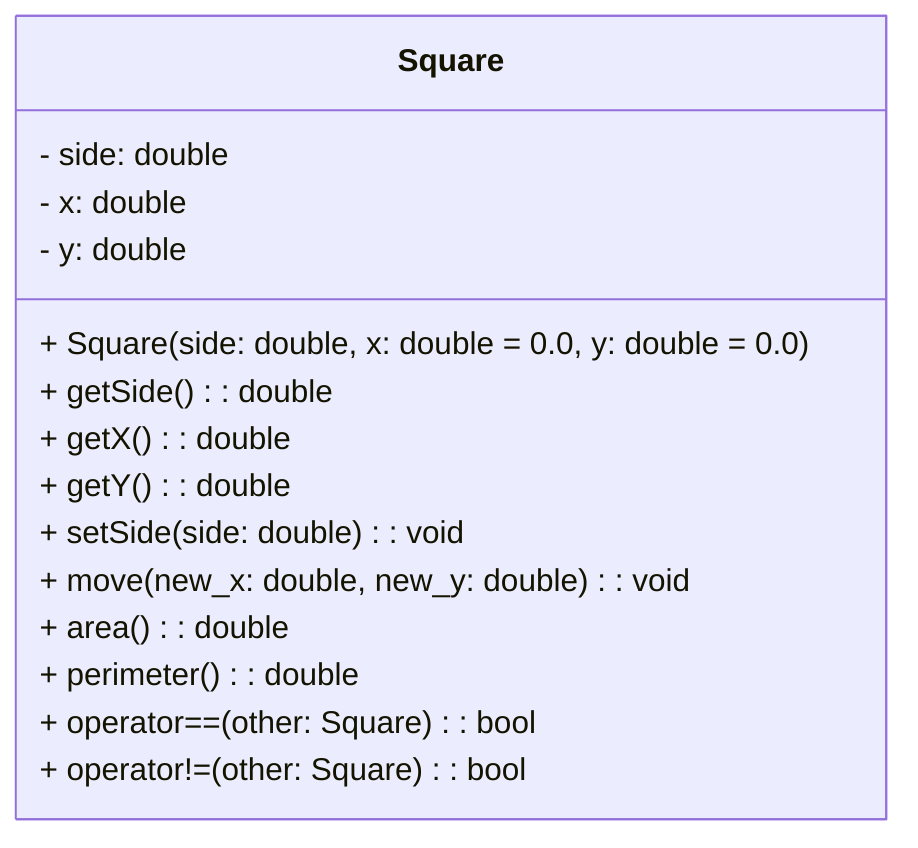

# ADT Квадрат

- **Данные**  
  - `side` — длина стороны квадрата (вещественное число, `side > 0`)  
  - `x`, `y` — координаты центра квадрата на плоскости (вещественные числа)

- **Операции**

  - **Конструктор**  
    - **Вход**: `side`, `x`, `y` (опционально)  
    - **Предусловия**: `side > 0`  
    - **Процесс**: инициализация полей квадрата  
    - **Выход**: объект «Квадрат»  
    - **Постусловия**: `this.side == side`, `this.x == x`, `this.y == y`

  - **Операция «Получить сторону»**  
    - **Вход**: —  
    - **Предусловия**: —  
    - **Процесс**: возврат значения поля `side`  
    - **Выход**: `side`  
    - **Постусловия**: состояние объекта не изменяется

  - **Операция «Установить сторону»**  
    - **Вход**: новое значение `side_new`  
    - **Предусловия**: `side_new > 0`  
    - **Процесс**: присваивание `side = side_new`  
    - **Выход**: —  
    - **Постусловия**: `this.side == side_new`

  - **Операция «Переместить квадрат»**  
    - **Вход**: новые координаты `new_x`, `new_y`  
    - **Предусловия**: —  
    - **Процесс**: изменение координат центра  
    - **Выход**: —  
    - **Постусловия**: `this.x == new_x`, `this.y == new_y`

  - **Операция «Вычислить площадь»**  
    - **Вход**: —  
    - **Предусловия**: —  
    - **Процесс**: вычисление по формуле `S = side²`  
    - **Выход**: площадь (вещественное число)  
    - **Постусловия**: состояние объекта не изменяется

  - **Операция «Вычислить периметр»**  
    - **Вход**: —  
    - **Предусловия**: —  
    - **Процесс**: вычисление по формуле `P = 4 × side`  
    - **Выход**: периметр (вещественное число)  
    - **Постусловия**: состояние объекта не изменяется

  - **Операция «Получить строковое представление»**  
    - **Вход**: —  
    - **Предусловия**: —  
    - **Процесс**: форматирование данных в строку вида  
      `"Square(side=5.00, center=(1.00,2.00))"`  
    - **Выход**: строка  
    - **Постусловия**: состояние объекта не изменяется  
**Конец ADT Квадрат**

---

Конструктор — специальный метод, который вызывается при создании объекта.
Геттер — метод для чтения значения поля, например side.
Сеттер — метод для изменения длины стороны.