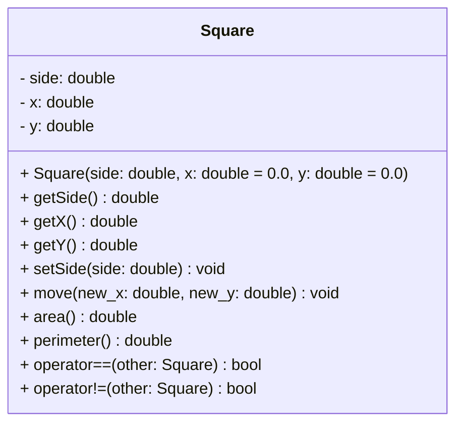

```mermaid
classDiagram
%% class Square["Square"]
        class Square{
        - side: double
        - x: double
        - y: double

        + Square(side: double, x: double = 0.0, y: double = 0.0)
        + getSide() double
        + getX() double
        + getY() double
        + setSide(side: double) void
        + move(new_x: double, new_y: double) void
        + area() double
        + perimeter() double
        + operator==(other: Square) bool
        + operator!=(other: Square) bool
}
```
